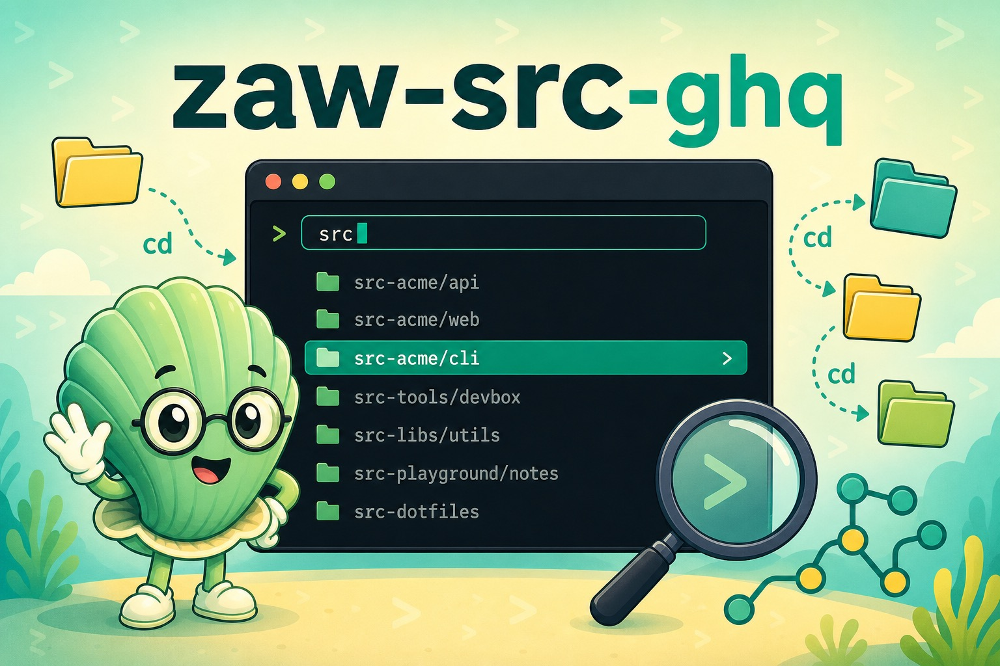

# zaw-src-ghq

   



Optional sources of [zaw](https://github.com/zsh-users/zaw) for [ghq](https://github.com/motemen/ghq):

- ghq

It shows list of your local repos managed by ghq, then cd, remove or browse repo you choose.

## Installation

If you are using zplug, just add the code below in your .zshrc.

```zsh
zplug "zsh-users/zaw"
zplug "GeneralD/zaw-src-ghq", on:zsh-users/zaw, defer:2
```

For oh-my-zsh, clone this repo into ~/.oh-my-zsh/custom/plugins and add plugin as below.

```zsh
plugins+=(zaw zaw-src-ghq)
```

## Dependencies

- ghq
- jq

If you are using macOS, you can install with,

```sh
brew install ghq jq
```

- any nerd-font

This zaw source shows characters of nerd-font.
You can search compatible font with,

```sh
brew cask search nerd-font
```

Then, install and set any nerd-font to your terminal application.
